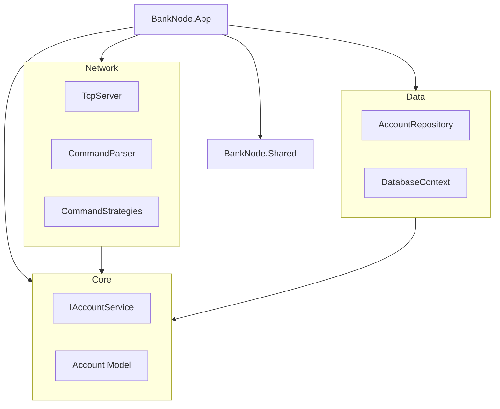
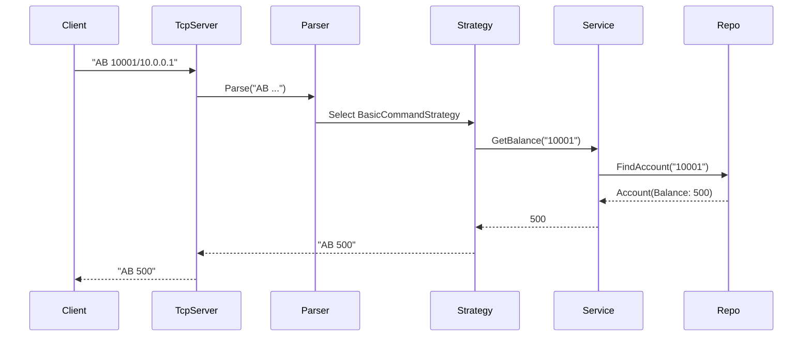

# P2P Bank Node - Hacker Edition Documentation

**Author:** Miro Slezák
**Date:** 2026-01-16  
**School:** SPŠE Ječná 
**Project:** P2P Bank Node (Hacker Difficulty)

---

## 1. Specification & Requirements

### Project Summary
This project implements a **Peer-to-Peer (P2P) Bank Node** that simulates a banking system. Each node in the network represents a bank capable of managing accounts, transactions, and communicating with other bank nodes via TCP/IP. The goal is to create a decentralized banking network where nodes can query each other and perform cross-bank operations.

This implementation aims for the **Hacker Bank Node** difficulty level, which includes:
-   Basic banking operations (Create, Deposit, Withdraw, Balance, Remove).
-   Proxy functionality (Forwarding requests to other nodes).
-   **Robbery Plan (RP)**: An advanced algorithm to calculate optimal robbery strategies across the P2P network.
    > *Note: The Robbery Plan uses a greedy density-based heuristic ($/client) to approximate the optimal strategy in O(N log N) time.*

### Allowed Commands

All commands are sent as UTF-8 text ending with a newline.

**Address Format**: Accounts are identified as `<account_number>/<ip>`. You can optionally specify a port: `<account_number>/<ip>:<port>`. This is useful for testing multiple nodes on the same machine.

| Command | Syntax | Description | Success Response | Error Response |
| :--- | :--- | :--- | :--- | :--- |
| **Bank Code** | `BC` | IP Check. Returns node IP. | `BC <ip>` | `ER <msg>` |
| **Account Create** | `AC` | Create new account. | `AC <acc>/<ip>` | `ER <msg>` |
| **Account Deposit** | `AD <acc>/<ip> <amt>` | Deposit money. | `AD` | `ER <msg>` |
| **Account Withdraw** | `AW <acc>/<ip> <amt>` | Withdraw money. | `AW` | `ER <msg>` |
| **Account Balance** | `AB <acc>/<ip>` | Get balance. | `AB <amount>` | `ER <msg>` |
| **Account Remove** | `AR <acc>/<ip>` | Delete account (if 0 balance). | `AR` | `ER <msg>` |
| **Bank Amount** | `BA` | Total money in bank. | `BA <amount>` | `ER <msg>` |
| **Bank Number** | `BN` | Number of clients. | `BN <count>` | `ER <msg>` |
| **Robbery Plan** | `RP <target_amount>` | Calculate robbery plan (Hacker feature). | `RP <strategy_msg>` | `ER <msg>` |

---

## 2. Architecture & Design Patterns

The application follows **Clean Architecture** principles to ensure modularity, testability, and separation of concerns.

### Layered Structure

1.  **BankNode.Core**: The heart of the application. Contains Domain Entities (`Account`, `Transaction`) and Service Interfaces (`IAccountService`). It has no dependencies on external libraries.
2.  **BankNode.Data**: Implements persistence. Contains `AccountRepository` and manages data storage (File System or SQLite).
3.  **BankNode.Network**: Handles TCP/IP communication.
    -   **TcpServer**: Listens for incoming connections.
    -   **CommandParser**: Identifies commands.
    -   **Command Strategies**: Executes logic for specific commands.
4.  **BankNode.Translation**: Handles internationalization (Czech/English output).
5.  **BankNode.App**: The entry point. Configures Dependency Injection (DI) and starts the server.

### Design Patterns Used

-   **Strategy Pattern**:
    -   Used in **Command Parsing**: Each command (`BC`, `AC`, etc.) is encapsulated in its own strategy class implementing `ICommandStrategy`. This makes adding new commands (like `RP`) easy without modifying the core parser.
    - Used in **Translation**: `ITranslationStrategy` allows generic switching of languages. Implemented by `JsonFileTranslationStrategy`, which loads languages from JSON files.
-   **Repository Pattern**: `IAccountRepository` abstracts the data storage layer. The core logic doesn't care if data is in a text file or SQLite database.
-   **Dependency Injection (DI)**: The `Program.cs` builds a `ServiceProvider` to inject repositories, services, and loggers into constructors.
-   **Singleton Pattern**: Used for the TCP Server instance and Configuration.

### Component Diagram



---

## 3. Application Flow

### Startup Sequence
1.  **Load Configuration**: `AppConfig` is loaded (Port: 65525, Timeout: 5s, NodeIP).
2.  **Setup DI**: Register interfaces and implementations.
3.  **Start TCP Server**: `TcpServer` starts listening on the configured port.

### Request Handling Flow
When a client sends a command (e.g., `AB 10001/10.0.0.1`):



---

## 4. Configuration

Configuration is managed via the `AppConfig` class.

-   **Port**: Default `65525`. Must be between 65525 and 65535.
-   **Timeout**: Default `5000` ms. Used for both client inactivity and proxy request timeouts.
-   **Language**: Default `en`. Loads translation strings from `languages/<language>.json`.
-   **NodeIp**: The IP address this node advertises. Can be auto-detected or manually set.

Configuration is loaded from `config.json` in the application root. Use `config.json.example` as a template.

---

## 5. Persistence

The application is designed to support persistent storage.

-   **Data Storage**: Accounts are stored in **File System (NDJSON)** (`accounts.json`) - Line Delimited JSON, to survive restarts.
-   **Concurrency**: Thread-safe access to data is ensured via locks or DB transaction isolation, allowing parallel client handling.
-   **Logging**: Logs are written to both **Console** and **node.log** file for persistent tracking of node activity.


---

## 6. Installation & Usage

### Prerequisites
-   .NET 8.0 SDK
-   Windows OS (for School PC compatibility)

> **Note:** You can change the target framework version by running the `change_target_net_framework.bat` script in the root directory. This updates the configuration in `src/Directory.Build.props`.

### Building
Navigate to the `src` directory and run:

```bash
dotnet build
```

### Configuration
Create a `config.json` file in the application directory. You can copy `config.json.example` and rename it.

```json
{
  "Port": 65525,
  "Timeout": 5000,
  "NodeIp": "127.0.0.1",
  "Language": "en"
}
```

### Running
Run the application from the `BankNode.App` folder:

```bash
cd src/BankNode.App
dotnet run
```

### Command Line Arguments
You can override configuration values using command line arguments:

-   `--port <number>`: Sets the listening port (overrides `config.json`).
-   `--ip <address>`: Sets the advertised IP address (overrides `config.json`).

Example:
```bash
dotnet run -- --port 65530 --ip 192.168.1.50
```

### connecting
Use PuTTY or Telnet to connect to `localhost` on port `65525` (or configured port).

```bash
telnet localhost 65525
```

Once connected, you can switch language using the `LANG` command:
```bash
LANG cz  # Switch to Czech
LANG en  # Switch to English
```

### Server Console
The server window accepts the following local commands:
- `HELP`: Show available local commands.
- `BN`: Show local bank statistics (Count, Total Balance).
- `EXIT`: Gracefully stop the server.

---

## 7. Error Handling

All Application errors follow the protocol format `ER <message>`.

-   **Invalid Command**: `ER Unknown command.`
-   **Format Error**: `ER Invalid format.`
-   **Logic Error**: `ER Insufficient funds.`

Internal exceptions are logged using `ILogger` but never exposed raw to the client.

---

## 8. Requirements Checklist (Zadani.md)

-   [x] **P2P Architecture**: Node acts as both server and client (Proxy feature).
-   [x] **TCP/IP**: Listens on specific ports.
-   [x] **Command Protocol**: Implements BC, AC, AD, AW, AB, AR, BA, BN.
-   [x] **Hacker Goal**: `RP` (Robbery Plan) command planned/structured.
-   [x] **Configuration**: Port and Timeout configurable.
-   [x] **Logging**: `ILogger` interface for tracking operations.
-   [x] **Documentation**: This file.
-   [x] **Reused Code**: Structure inspired by clean architecture best practices.

## 9. Reused & Adapted Code

This project explicitly reuses and adapts code from previous portfolio projects (`RDBMS` and `ChronoLog`) to meet the requirement for code reuse and genericity.

### 1. Request Logging (from `RDBMS`)
-   **Source**: `RDBMS/Hotel.Backend/Middleware/RequestLoggingMiddleware.cs` (ASP.NET Middleware)
-   **Adaptation**: Converted into **`BankNode.Network.RequestLoggingDecorator`**.
-   **Description**: This generic Decorator implementation wraps the Command Processing logic. It measures execution time and logs incoming/outgoing commands and errors to both Console and File. This demonstrates adapting the "Middleware pattern" from a Web API to a raw TCP server.

### 2. File Chunk Iterator (from `ChronoLog`)
-   **Source**: `ChronoLog/src/file_chunk_reader.py` (Python)
-   **Adaptation**: Ported to C# as **`BankNode.Shared.IO.FileChunkIterator`**.
-   **Description**: A memory-efficient file reader that iterates over large files line-by-line (chunked). It is used in `FileAccountRepository` to load the database (now stored as NDJSON) without loading the entire file into memory at once.

### 3. Generic Components
-   **File Logger (`BankNode.Shared.Logging`)**: Generic `ILoggerProvider` implementation.
-   **Command Strategy Pattern (`BankNode.Network.Strategies`)**: Decoupled command logic.
-   **Translation System (`BankNode.Shared.Translation`)**: Interface-based i18n.

## 10. Third-Party Libraries
-   **xUnit**: For Unit and Integration testing.
-   **Microsoft.Extensions.DependencyInjection**: For IoC container.
-   **Microsoft.Extensions.Logging**: Abstraction for logging.